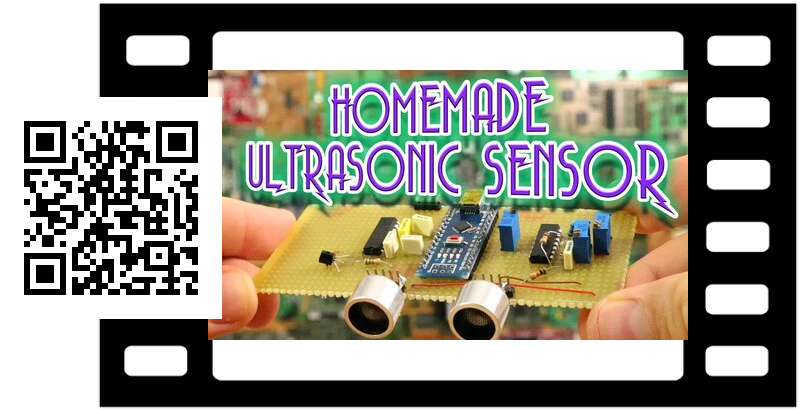

# Youtube Playlist to QR Code Script

This script takes as input a playlist id from Youtube and an API key. It then retrieves thumbnails for all the items in the playlist, and overlays it with a film frame and a QR code.

You can get an API key from Youtube: https://developers.google.com/youtube/v3/getting-started

The playlist you use, must not be private, I think.

Example use:

```bash
./yt-list-to-qr-thumb.sh 
Usage: ./yt-list-to-qr-thumb.sh <playlistid> <apikey>

Example: ./yt-list-to-qr-thumb.sh PL9728A6605538F807 your-key-here
```

creates images like this



The current resolution of the frame is somewhat low and all thumbs are resized to match. No adjustments for aspect ratio is made.

Works-for-me (tm).


